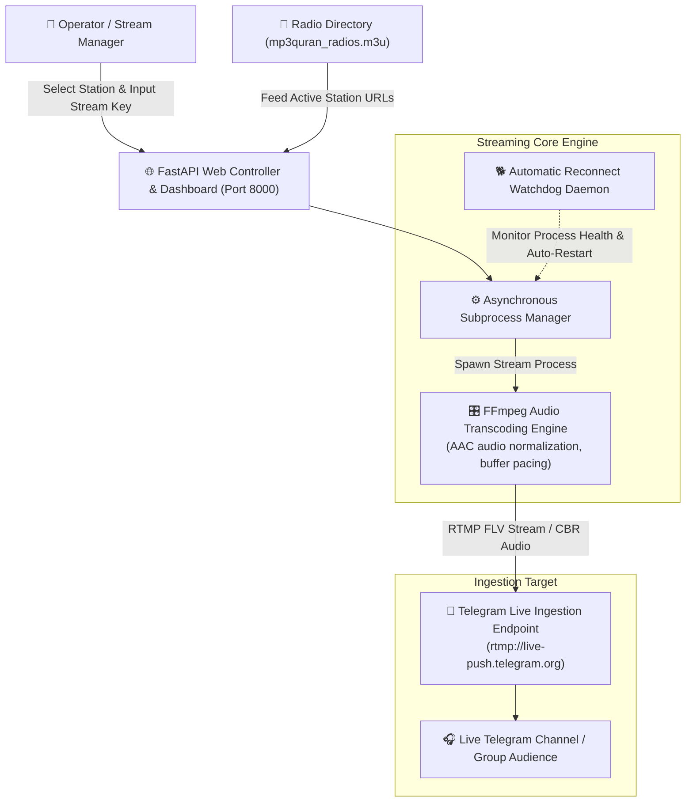

<div align="center">

# 📻 Quran Stream (`quran-stream`)

### Continuous Live Quran Radio Streaming Microservice to Telegram via RTMP

[](https://www.python.org/)
[](https://fastapi.tiangolo.com/)
[](https://ffmpeg.org/)
[](https://en.wikipedia.org/wiki/Real-Time_Messaging_Protocol)
[](https://www.docker.com/)
[](https://telegram.org/)
[](LICENSE)

**Multi-Station M3U Playlist Parser • Real-Time Audio Transcoder • Telegram RTMP Direct Push • 24/7 Watchdog**

[System Architecture](#-streaming-pipeline-architecture) • [Key Capabilities](#-key-capabilities) • [Docker Deployment](#-docker-deployment) • [Local Setup](#-local-setup)

</div>

---

## 🎯 Overview

**Quran Stream** is a resilient, lightweight multimedia streaming microservice engineered to broadcast continuous Quranic radio stations directly into **Telegram Video Chats / Live Streams** (or any RTMP-compatible broadcast destination like YouTube Live or Twitch).

Built on top of an asynchronous **FastAPI** web controller and an optimized **FFmpeg** audio processing pipeline, it ingests remote radio streams, standardizes audio bitrates, prevents stream starvation, and pushes continuous FLV-muxed RTMP packets with ultra-low latency and minimal resource consumption.

---

## 🏗 Streaming Pipeline Architecture



---

## 🌟 Key Capabilities

- 📡 **Universal Station Catalog:** Dynamically parses radio directories (`.m3u`) with hundreds of reciters and specialty stations from trusted global Quran radio sources.
- 🎛️ **Optimized FFmpeg Transcoding Pipeline:** Standardizes input audio to AAC 128kbps, 44.1kHz CBR format, ensuring zero stuttering, jitter reduction, and full compliance with Telegram ingestion specs.
- 🔄 **Autonomous Reconnection Watchdog:** Automatically intercepts connection drops or stream timeouts, reconnecting and re-establishing the RTMP handshake within seconds without requiring manual intervention.
- 💻 **Intuitive Web Controller:** Web-based interface to switch active reciters, adjust stream parameters, monitor real-time uptime, and toggle broadcasting status.
- 🪶 **Minimal Resource Footprint:** Tuned for continuous 24/7 background operation on low-spec VPS environments, consuming less than **80MB of RAM** and negligible CPU overhead.
- 🐳 **Turnkey Docker Stack:** Includes bundled FFmpeg audio utilities, Python dependencies, and startup configuration in a single command.

---

## 🐳 Docker Deployment

### Prerequisites
- [Docker Engine](https://docs.docker.com/engine/install/) & [Docker Compose](https://docs.docker.com/compose/) v2+

### Quick Start
Clone the repository and launch the containerized streaming service:

```bash
# Clone the repository
git clone https://github.com/3bkader-gpt/quran-stream.git
cd quran-stream

# Build and start container in detached mode
docker compose up -d --build
```

The streaming control panel will be live at:
```text
http://<server-ip>:8000/
```

### Operational Commands
```bash
# Check container status
docker compose ps

# Inspect live streaming logs and FFmpeg output
docker compose logs -f

# Shut down the stream service
docker compose down
```

---

## 💻 Local Setup (without Docker)

### Prerequisites
- **Python 3.10+**
- **FFmpeg** installed and accessible in system `PATH` (Verify via `ffmpeg -version`)

### Installation & Run

```bash
# 1. Prepare virtual environment
python -m venv .venv

# On Linux/macOS:
source .venv/bin/activate
# On Windows:
.venv\Scripts\activate

# 2. Install Python dependencies
pip install -r requirements.txt

# 3. Start the application controller
uvicorn main:app --host 0.0.0.0 --port 8000 --reload
```

Open `http://localhost:8000` to manage your radio streams.

---

## 📡 Telegram Streaming Setup

1. In your Telegram Channel or Group, open the **Live Stream** or **Video Chat** menu.
2. Select **Stream With...** to obtain your unique **Server URL** and **Stream Key**.
3. Paste the URL and Stream Key into the Quran Stream web dashboard.
4. Select your preferred reciter/station and click **Start Streaming**.

---

## 📄 License

This project is open-source under the [MIT License](LICENSE).
